# glowby\_starlight
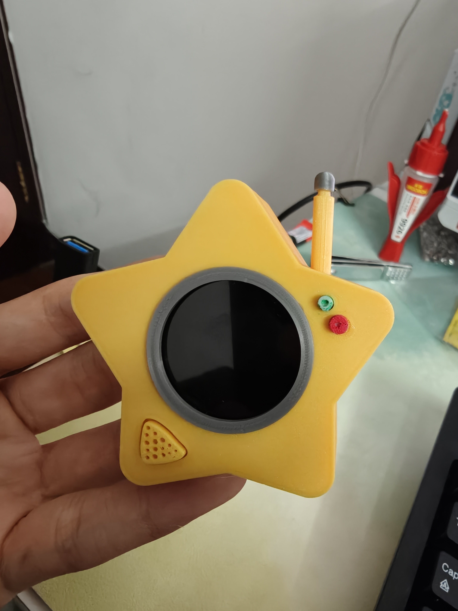
波比的游戏时间内的格洛比星星灯 the GLOWBY in Poppy Playtime
### 创作与 AI 声明 (Creation & AI Attribution)

本项目是一个 **“人机协作”** 的产物，具体的贡献分布如下：

*   **硬件与外壳设计** **100% 人工制作**。3D 模型（STL 文件）完全由作者建模设计，未使用 AI 生成方案。
*   **项目文档 (README)**：大部分由 **作者手写**，详细记录了项目的安装、接线及使用说明。
*   **源代码 (.ino)**：底层逻辑与功能实现主要由 **人工智能 (AI)** 根据作者的功能需求生成。作者负责了全局的架构设计、硬件引脚适配及功能联调。

> **⚠️ 风险提示**：由于代码部分主要由 AI 生成，虽经作者实机测试可用，但仍可能存在未知的逻辑问题。

对于3d模型和文档，使用CC0 1.0 Universal协议进行分发

## 快速起步

### 1\.购买所需的硬件
#### 首先准备好热熔胶，强力胶，typec数据线
以下内容仅作为参考，任何店铺均没有给我赞助
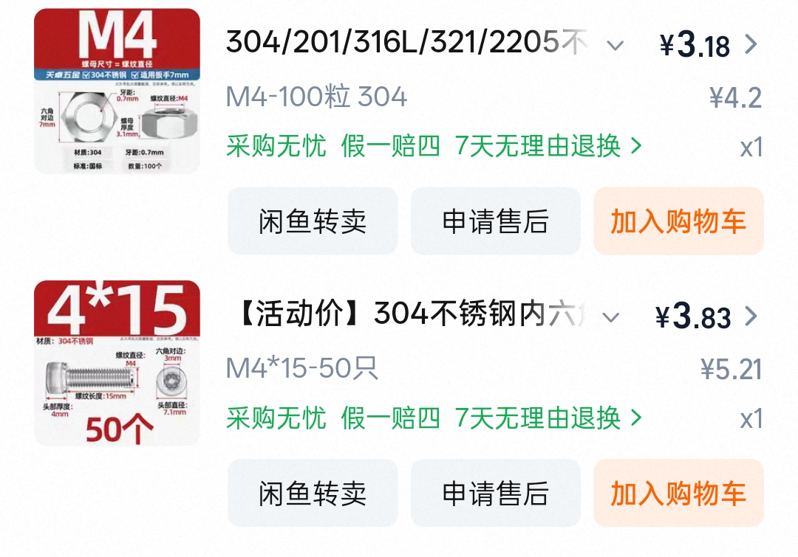

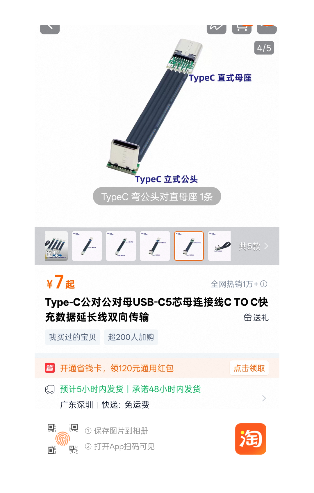

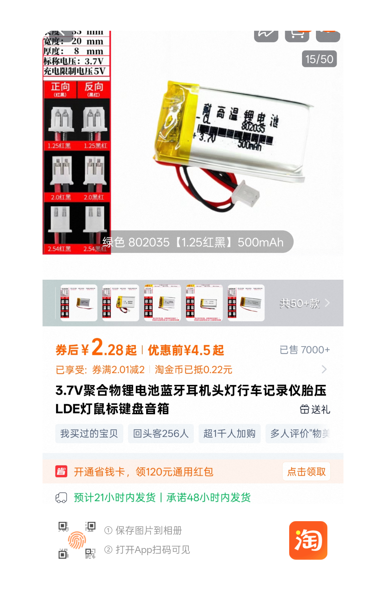

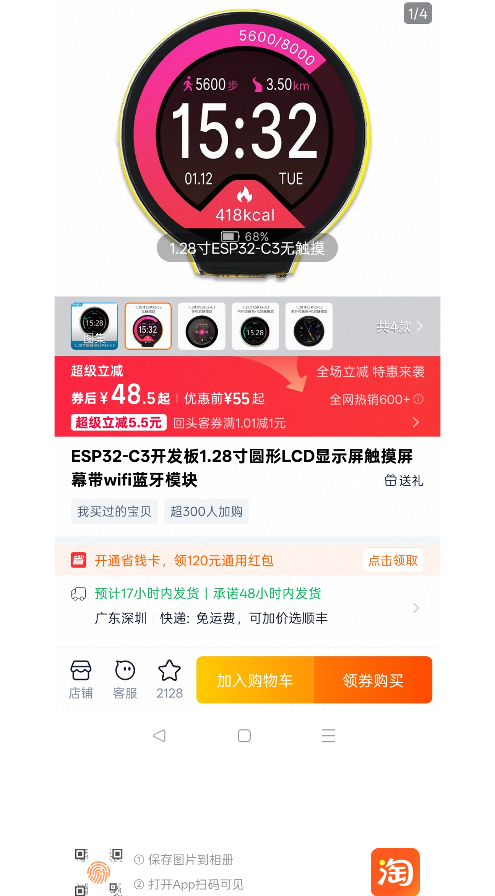

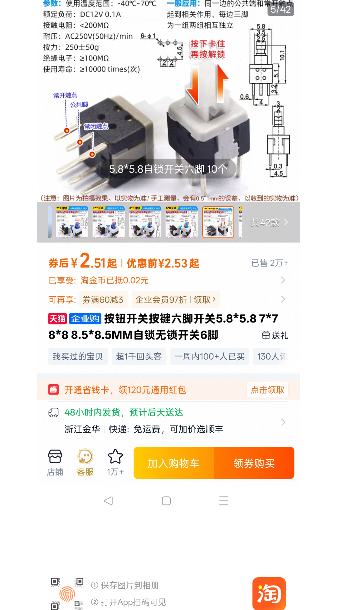

#### 除此之外，你还需要model文件夹下的所有3d打印文件，可以自行打印或是把文件发送给对应的淘宝厂家，建议使用0.2mm喷嘴打印
##### 装饰-屏幕遮丑圈 装饰-天线帽 我使用银色打印
##### 功能-开关 装饰-开关 由于太小，特地买那两种耗材不划算，于是使用白色打印并马克笔涂色
##### 其余使用金色（不是丝绸金！）打印

### 2\.搭建硬件
#### 首先把 功能-电路激活按键 塞进外壳预留的圆形槽中，如果不顺滑，则抹一点润滑油（我是直接摸了一把3d打印机的丝杆然后抹上面了）
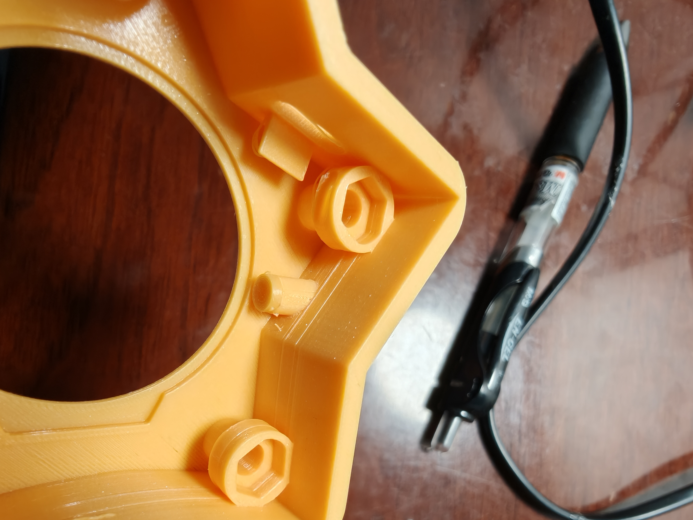
#### 装好之后从外面看效果应该像这样（注意，这一步必须确认其工作顺滑，不然后面很难改）
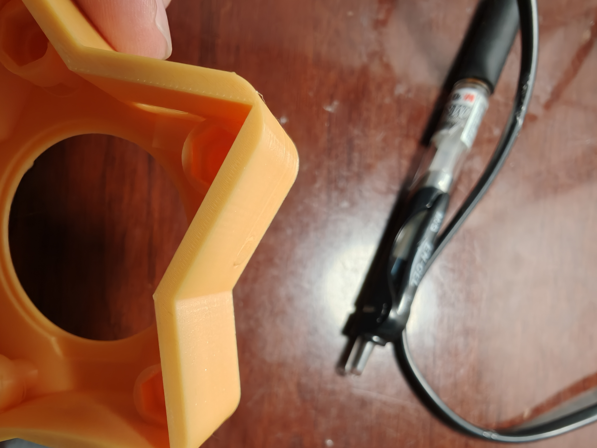
#### 然后把屏幕模块与延长线和天线（跟屏幕模块附赠的）进行连接（天线接口可以稍微点一点热熔胶，防止松脱）
#### 把屏幕放进外壳里并用热熔胶固定一周（天线此时可以就近粘在外壳上（注意避开开关位置））
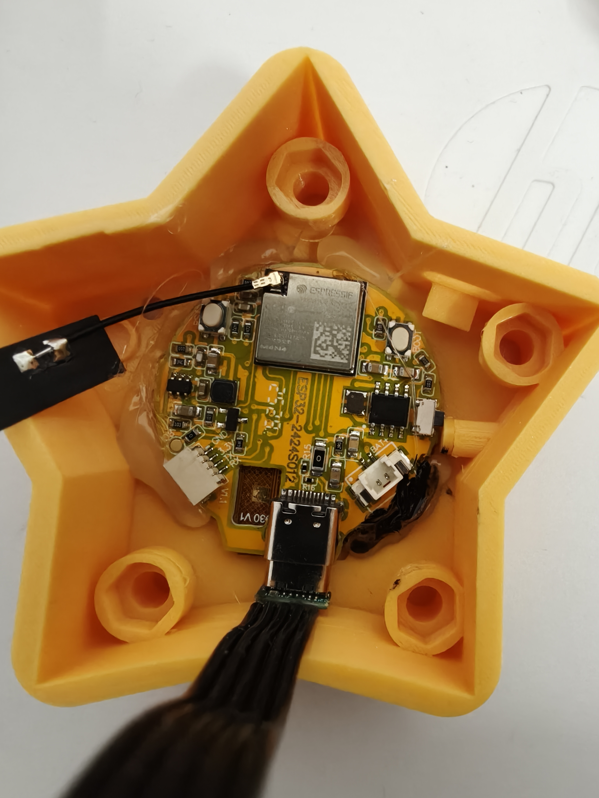
#### 接下来焊接电池的开关，自锁开关尽量靠近电池焊接，线够长的话留一点余量，焊接之前笔划一下，掰掉其中一边的三个脚（必须，不然放不下），在剩下的三个脚里掰掉常开脚（这个不掰也行），确保开关可以放在预留的位置上（见组装完成效果图）焊接完之后建议用热熔胶进行加固。
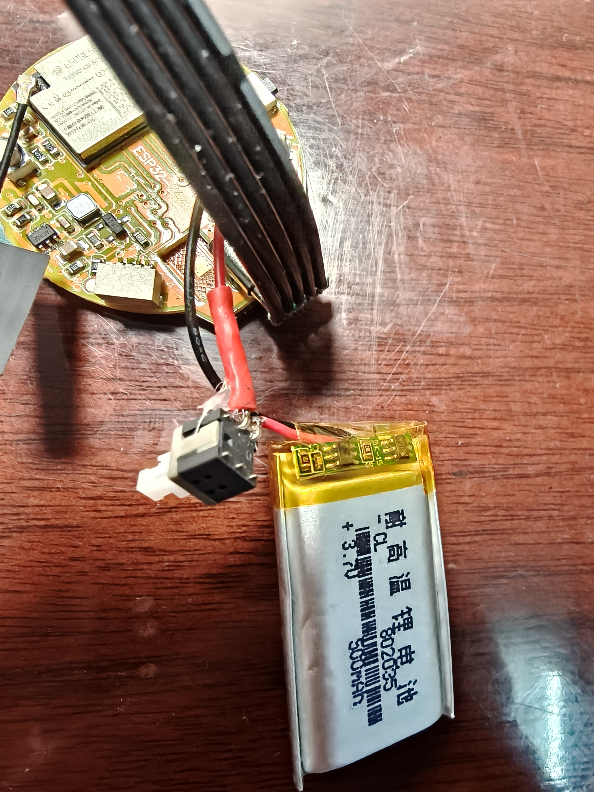
#### 下一步固定延长线接口，我使用先热熔胶初固定，再强力胶固定（切记不可只热熔胶，插拔几次就掉了）
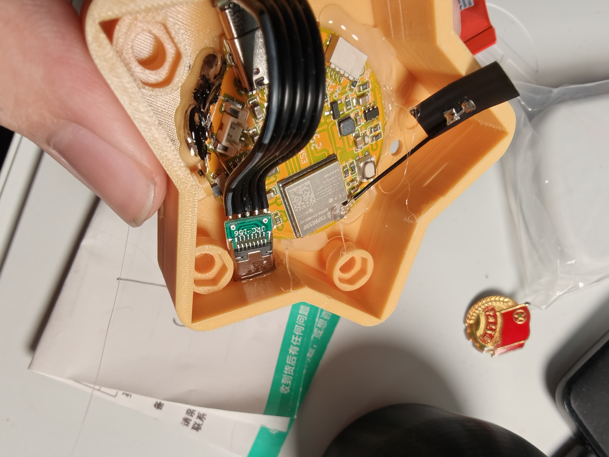
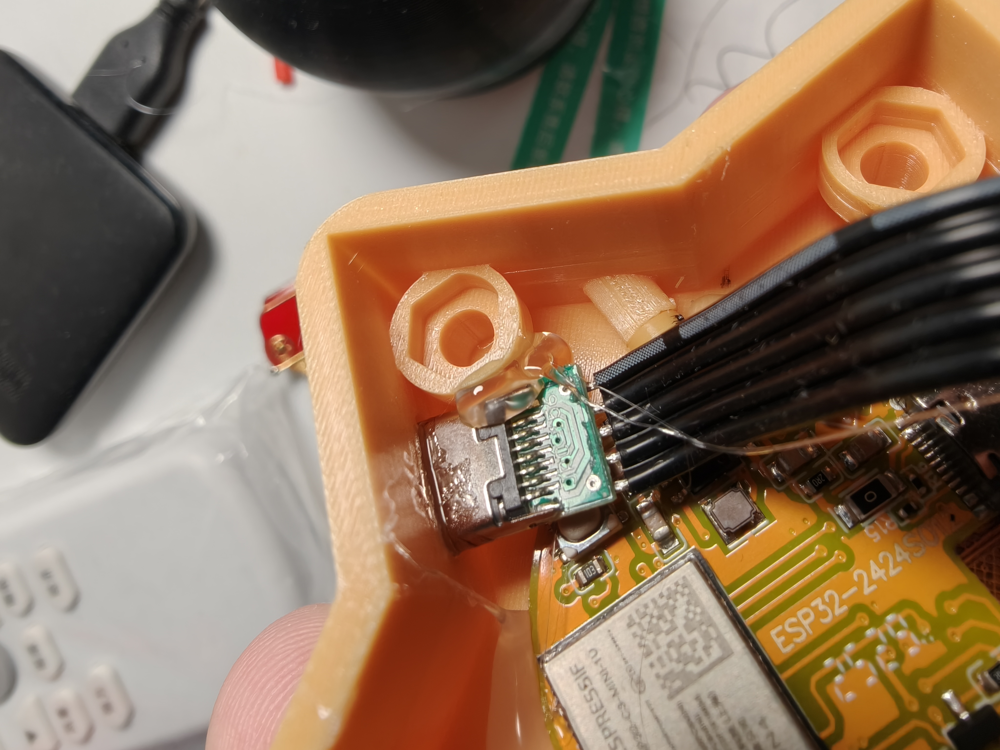
#### 随后就可以插上电池了，柔软的线缆正好为电池提供缓冲和支撑（当然有点海绵什么的就更好了（我没有））
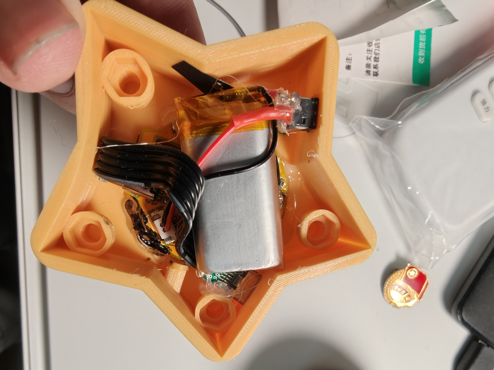
#### 把 功能-开关 放入预留的槽中，在下方加上少量的热熔胶，然后迅速把开关固定上（我用的强力胶）
#### 随后嵌入四颗螺母并使用强力胶固定
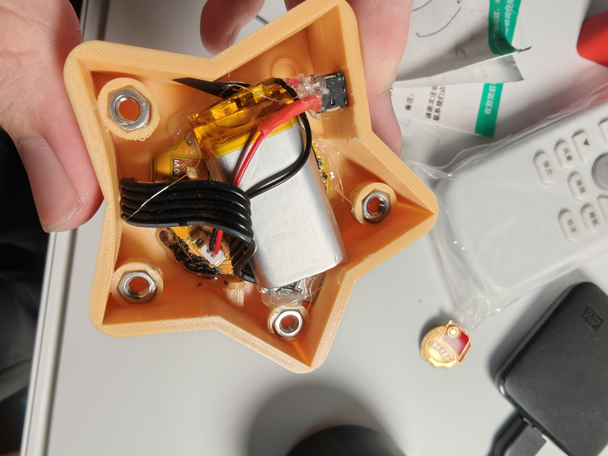
#### 盖上后盖并拧上螺丝，参考首图固定其他装饰件

### 3\.烧录程序
#### 下载arduino，打开ino文件，确保开发板型号选择为esp32c3 dev kit
#### 确保上方tool内设置如图
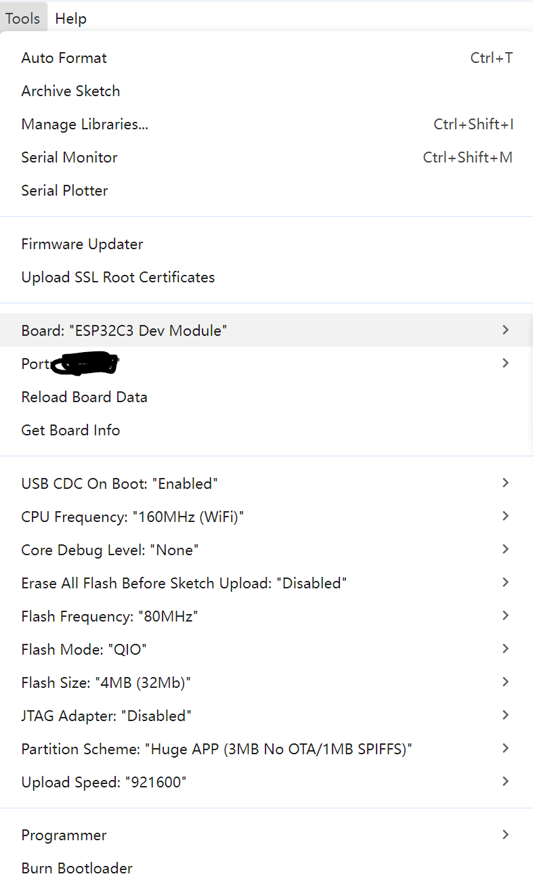
#### 点击upload等待烧录完成

## 注意
### 由于模块设计问题，电池上电后不会开机，需要按一下 功能-电路激活按键才能开机
### 充电时务必开机，否则充不上
---
## 使用说明（部分ai生成）
# Web 控制台使用指南


> **连接说明**：设备启动后，连接至名为 `glowby星星灯` 的 WiFi，密码默认12345678，在浏览器输入默认 IP 地址（通常为 `192.168.4.1`）即可进入控制台。

---

## 🛠️ 1. 顶部全局控制栏 (悬浮固定)

控制台顶部是全局设置区域，无论您滑动到页面哪个位置，都可以随时调整相框的基础运行状态。

*   **存储信息 (存储: XX K / XX K)**：实时显示 ESP32 内部 LittleFS 文件系统的已用空间与总空间。
*   **轮播 (开关)**：勾选后，相框将按照设定的时间间隔自动播放打勾的图片。取消勾选则画面静止。
*   **随机 (开关)**：勾选后，轮播顺序变为随机抽取；取消勾选则按文件列表顺序循环播放。
*   **网络图片 (开关)**：**核心功能！** 勾选后，重启后设备将切入“网络图片模式”，系统将暂停本地轮播，开始从您设定的公网地址抓取并显示图片（详情见第 3 节）。
*   **间隔秒数 (秒)**：设置每张图片的停留时间。注意：修改后会立即自动保存并生效。
*   **顶部输入框可以的输入开机时要显示的文字**

---

## 📁 2. 本地图片界面 (默认标签页)

在此界面中，您可以管理保存在设备内部芯片（Flash）上的静态图像。

### 2.1 开机显示文本
*   **功能**：设置每次设备通电或重启后，屏幕中心短暂显示（2秒）的欢迎语。
*   **操作**：在文本框内输入英文字符或数字（受限于字体库，建议使用英文），点击 “保存”。下次开机即可生效。

### 2.2 上传新图片
*   **支持格式**：.jpg, .jpeg, .png, .bmp。
*   **操作**：点击“选择文件”选取本地图片，然后点击 “上传新图片”。
*   **注意**：ESP32 内存有限，上传的图片分辨率必须为 **240x240**。若是 PNG 格式，强烈建议导出为 **8位(256色) 无透明通道** 的格式，以防内存溢出黑屏。

### 2.3 照片管理网格
*   **复选框 (☑️)**：决定该图片是否参与自动轮播。打勾代表加入轮播队列，取消打勾则跳过此图。配置断电永久保存。
*   **图片预览**：点击图片本体，屏幕会立刻切换并显示该图。
*   **立即展示 (按钮)**：无论该图是否被勾选轮播，点击此按钮可强制屏幕立即显示该图。
*   **删除 (按钮)**：从芯片中彻底删除该文件以释放存储空间。

---

## 🌐 3. 网络图片界面

开启顶部控制栏的“网络图片”开关后，设备将激活此面板内的配置。在此模式下，设备会作为客户端短暂连接您家中的 WiFi 以批量下载图片。

### 3.1 基础网络配置
*   **WiFi SSID**：请输入您家中的路由器 WiFi 名称（必须为 2.4G 网络）。
*   **WiFi 密码**：输入对应的 WiFi 密码。

### 3.2 抓取规则设置（两种模式任选其一）
设备支持两种不同的网络图片抓取逻辑，系统会优先读取“详细链接”，若为空则读取“公网网址”。

#### 模式 A：公网网址批量模式 (自增编号)
*   **原理**：如果您有一个存放按数字命名图片的服务器目录。
*   **填写示例**：
    *   公网网址 填写：`http://yourdomain.com/images`
    *   设备将自动按序请求：`.../1.jpg`、`.../2.jpg` ... 直至 `999.jpg` 后循环。

#### 模式 B：详细链接模式 (精准抓取)
*   **原理**：直接指定每一张图片的绝对路径。
*   **填写示例**：在 “详细链接” 文本框内填入完整 URL（需以 http/https 开头），一行一个：
    ```text
    [https://img.cdn.com/cat_1.png](https://img.cdn.com/cat_1.png)
    [https://img.cdn.com/dog_2.jpg](https://img.cdn.com/dog_2.jpg)
    ```
*   **每轮读取数**：设定设备每次联网拉取多少张图片（建议设为 5，最大不超过 10，以防占满内部存储）。

### 3.3 无缝后台下载机制
*   **首次连接**：开启该模式后的第一轮抓取，屏幕会显示白色的 "Connecting WiFi..." 和下载状态，成功后开始展示。
*   **后台静默抓取**：当第一轮的图片即将展示完毕时，设备会在后台静默连接 WiFi 拉取下一批新图。在此期间，屏幕会一直保持显示上一轮的最后一张图，直到新图下载完毕并无缝切换，绝不黑屏！

---

## 🚨 4. 紧急救援模式 (Safe Mode)

如果因为填错了网络配置，或者下载了超大体积的错误图片，导致设备无限黑屏、死机或反复重启，您可以通过串口（Serial）进行紧急救援。

1.  使用 **Type-C** 数据线将开发板连接至电脑。
2.  打开 Arduino IDE 串口监视器，波特率设置为 **115200**。
3.  在发送框中输入准确的字符串：`safemode` 并点击发送。

**触发效果：**
*   屏幕立即变黑，随后居中显示红色警示文字：`SAFE MODE ON! RESTART TO QUIT`。
*   系统将永久擦除网络图片的开启状态并立刻中断所有正在执行的下载或轮播任务。
*   此时重启设备，即可安全退回到纯本地图片模式。